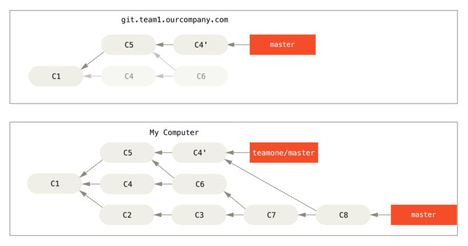

# git_practice

repository, repo: 倉庫

commit: 遞交 提交

staged: 預存 暫存

## 初始設定
安裝以後，設定使用者名稱和email
```bash
$ git config --global user.name "John Doe"
$ git config --global user.email johndoe@example.com
```
其他設定
```
$ git config --global core.editor vim
$ git config --global merge.tool=vimdiff
```

### git 別名
```
git config --global alias.ci checkout
git config --global alias.br branch
git config --global alias.ci commit
git config --global alias.st status
git config --global alias.last 'log -l HEAD'
...
```


### 列出個人設定
```bash
git config --list
```
git config --list命令列出所有 Git 在目前位置能找到的設定值:

### 三種取得 Git 命令說明文件的方法:
```bash
$ git help <verb>
$ git <verb> --help
$ man git-<verb>
```
例如 $git help config

## 建立專案

1. 把現有專案匯入到git中

2. 從伺服器上複製現有的Git倉庫

### 1. 把現有專案匯入到git中
在專案目錄底下：
```
$ git init
```
開始追蹤目錄底下所有檔案：
```
git add .
```
遞交commit
```
git commit -m "關於這次變更的敘述"
```

### 2. 複製現有倉庫

git clone 下載遠端repo

1. 使用https
```
$ git clone https://github.com/ittakes1/git_practice.git git_practice
```
說明 git clone https://網址/帳號名/項目名.git 目錄名
目錄名可以自行設定，如果不寫，項目名就是項目名

2. 使用ssh
```
$ git clone git@github.com:ittakes1/git_practice.git
```
說明 git clone git@網址:帳號名/項目名.git

## Git倉庫中記錄變更

工作目錄下的每一個檔案不是tracked已追蹤就是untracked未追蹤

已追蹤的檔案三種狀態
1. 已修改
2. 未修改
3. 已預存


### git add 命令追蹤單一的新檔案
要開始追蹤一個新的檔案,可以使用 git add 命令; 要開始追蹤 README 檔案,你可以執行:
```bash
$ git add README.md
```

### git status 命令檢查狀態
如果再次執行檢查狀態命令,可以看到 README.md 檔案現在是準備好被提交的「已追蹤」和「已預存」狀態:
```bash
$ git status
```
輸出
```
On branch master
Your branch is up-to-date with 'origin/master'.
```
簡潔版本: `git status -s`


## 預存修改過的檔案 git add

### 提交你的修改
現在你的預存區已被建構成你想要的，你可以開始提交你的變更； 記住：任何未預暫存的檔案——新增的、已修改的，自從你編輯它們卻尚未用 git add 預存的——將不會納入本次的提交中； 它們仍以「已修改」的身份存在磁碟中。 在目前情況下，假設你上次執行 git status 時，你看到所有檔案都已經被預存，因此你準備提交你的變更。 最簡單的提交方式是輸入 git commit：
```bash
$ git commit  # 這麼做會啟動你選定的編輯器
```
或者
```
$ git commit -m "Story 182: Fix benchmarks for speed" # -m 選項後方直接輸入提交訊息
[master 463dc4f] Story 182: Fix benchmarks for speed  
2 files changed, 2 insertions(+) 
create mode 100644 README
```
[master 463dc4f] Story 182: Fix benchmarks for speed  

提交到哪個分支（master）、提交的 SHA-1 校驗碼（463dc4f）

2 files changed, 2 insertions(+) 

有多少檔案被更動，以及統計此提交有多少列被新增和被移除

### 略過預存 git add + git commit一起用
在 git commit 命令加上 -a 選項，使 Git 在提交前自動預存所有已追蹤的檔案，讓你略過 git add 步驟：`
```
$ git commit -a -m 'added new benchmarks'
[master 83e38c7] added new benchmarks
1 file changed, 5 insertions(+), 0 deletions(-)
```

## 將變更發送到遠端repo (例如github.com)
```bash
$ git push origin master
```

## 忽略檔案 .gitignore檔案
gitignore - Specifies intentionally untracked files to ignore

* Patterns which should be version-controlled and distributed to other repositories via clone (i.e., files that all developers will want to ignore) should go into a `.gitignore` file.

* Patterns which are specific to a particular repository but which do not need to be shared with other related repositories (e.g., auxiliary files that live inside the repository but are specific to one user’s workflow) should go into the `$GIT_DIR/info/exclude` file.

* Patterns which a user wants Git to ignore in all situations (e.g., backup or temporary files generated by the user’s editor of choice) generally go into a file specified by core.excludesFile in the user’s ~/.gitconfig. Its default value is $XDG_CONFIG_HOME/git/ignore. If $XDG_CONFIG_HOME is either not set or empty, $HOME/.config/git/ignore is used instead.

### PATTERN FORMAT

* 空白行不處理

* 以#開頭表示註解 Put a backslash ("\") in front of the first hash for patterns that begin with a hash.

* 後綴空白不處理 unless they are quoted with backslash ("\").

* !邏輯非 which negates the pattern; any matching file excluded by a previous pattern will become included again. It is not possible to re-include a file if a parent directory of that file is excluded. Git doesn’t list excluded directories for performance reasons, so any patterns on contained files have no effect, no matter where they are defined. Put a backslash ("\") in front of the first "!" for patterns that begin with a literal "!", for example, "\!important!.txt".

* 目錄分隔符號/ is used as the directory separator. Separators may occur at the beginning, middle or end of the .gitignore search pattern.

* 以/開頭以避免路徑遞迴。（只忽略特定路徑；如果不以斜線開頭，則不管同名檔案或同名資料夾在哪一層都會被忽略。）

* 以/結尾代表是目錄。

* glob模式： *, [abc], ?


## 檢視已預存和未預存檔案的變更 git diff

檢視尚未預存的變更

想瞭解尚未預存的修改，輸入不帶其它參數的 git diff 這命令會比對「工作目錄」和「預存區」之間的版本， 然後顯示尚未被存入預存區的修改內容。
```
$ git diff
```

檢視已預存的變更

如果你想檢視你已經預存而接下來將會被提交的內容，可以使用 git diff --staged； 這個命令比對的對象是「預存區」和「最後一次提交」
```
$ git diff --staged
```

使用外部工具
```
git difftool --tool-help
git difftool --tool=vimdiff
```

## 移除檔案

要從 Git 中刪除一個檔案，你需要將它從已追蹤檔案中移除（更準確地說，是從預存區中移除），然後再提交； git rm 命令可完成此工作，它同時也會將該檔案從工作目錄中移除，如此它之後也不會身為未追蹤檔案而被你看到
```
$ git rm PROJECTS.md
```

## 看歷史記錄
### 看log
最新的在上面
```
git log

git log --pretty=short

git log --graph 圖示分支
```

### 看分支 git branch

git branch

git branch -a 顯示local and remote
創建,切換分支 git checkout -b

git checkout -b list-dict 等於 git branch list-dict 加 git checkout list-dict
切換到分支

git checkout master 到master

git checkout - 到上一個
合併分支 list-dict 到 master

git checkout master

git merge —no-ff list-dict
回溯舊版 git reset

看log

git reflog


## 使用遠端倉庫，與他人協作

### 顯示遠端倉庫

git remote

### 增加遠端倉庫
git remote add [shortname] [url]


### 擷取資料
git fetch [remote-name]

git fetch 只會把資料擷取到本機倉庫，不會自動合併資料，也不會動目錄下資料

git pull 自動取得遠端資料，並且合併入本機分支

### 發送資料到遠端倉庫
git push origin master

前提

1. 有權寫入
2. 沒別人早於你發送, 否則要處理合併衝突

### 檢查遠端倉庫
git remote show origin

### 刪除，改名遠端倉庫
git remote rename
git remote rm

## 標記 將特定歷史版本標記為重要版本

### 列舉標籤
git tag

### 建立標籤

* lightweight 輕量標籤

可以視為不變的分支

* annotated 註釋標籤

計算校正碼，記錄標記者名字，標記訊息...


### 註釋標籤
git tag -a v1.0 -m "版本 1.0"
git tag
git show v1.0

### 輕量標籤
git tag v1.0-1w
git tag

### 補加標籤
git log --pretty=oneline
git tag -a v0.8xxxxx(校正碼)


## 分支機制

Git 保存的不是變更集或者差異內容，而是一系列快照。當發起提交時，Git儲存的是物件commit object，該物件內容包含一個指標，用來代表已預存的快照內容； 這個物件內容還包含「作者名字和電子郵件」、「你輸入的訊息內容」、「指向前一個提交的指標（該提交的親代提交）」：沒有親代（parent）提交表示它是初始的第一個提交，一般情況下只有一個親代提交，超過一個親代提交表示它是從二個以上的分支合併而來的。


你的 Git 版本庫現在有五個物件：三個 blob 物件用來儲存檔案內容、一個樹物件用來列出目錄的內容並紀錄各個檔案所對應的 blob 物件、一個提交用來記錄根目錄的樹物件和其他提交資訊。


![alt text][1]

[1]: ./commit-and-tree.png "test"

如果你做一些修改並再次提交，這次的提交會再包含一個指向上次提交的指標（譯注：即下圖中的 parent 欄位）。

![alt text][2]

[2]: ./commits-and-parents.png

Git 分支其實只是一個指向某提交的可移動輕量級指標， Git 預設分支名稱是 master， 隨著不斷地製作提交，master 分支會為你一直指向最後一個提交， 它在每次提交的時候都會自動向前移動。

![alt text][3]

[3]:./branch-and-history.png

### 建立新分支

建立一個新分支會發生什麼事呢？ 答案很簡單，建立一個新的、可移動的指標； 比如新建一個 testing 分支， 可以使用 git branch 命令：
```
$ git branch testing
```
這會在目前提交上新建一個指標。


Git 如何知道你目前在哪個分支上工作的呢？ 其實它保存了一個名為 HEAD 的特別指標； 在 Git 中，它就是一個指向你正在工作中的本地分支的指標， 所以在這個例子中，你仍然在 master 分支上工作； 執行 git branch 命令，只是「建立」一個新的分支——它並不會切換到這個分支。


你可以很輕鬆地看到分支指標指向何處，只需透過一個簡單的 git log 命令， 加上 --decorate 選項。
```
$ git log --oneline --decorate
f30ab (HEAD -> master, testing) add feature #32 - ability to add new formats to the central interface
34ac2 Fixed bug #1328 - stack overflow under certain conditions
98ca9 The initial commit of my project
```
你可以看到「master」和「testing」分支就顯示在 f30ab 提交旁邊。

### 在分支之間切換
要切換到一個已經存在的分支，你可以執行 git checkout 命令， 讓我們切換到新的 testing 分支：
```
$ git checkout testing
```
這會移動 HEAD 並指向 testing 分支。


你一樣可以從 git log 中輕鬆地看出這件事， 執行 git log --oneline --decorate --graph --all，它會印出你的提交歷史，顯示你的分支指標在哪裡，以及歷史如何被分離開來。
```
$ git log --oneline --decorate --graph --all
* c2b9e (HEAD, master) made other changes
| * 87ab2 (testing) made a change
|/
* f30ab add feature #32 - ability to add new formats to the
* 34ac2 fixed bug #1328 - stack overflow under certain conditions
* 98ca9 initial commit of my project
```
由於 Git 分支實際上只是一個檔案，該檔案內容是這個分支指向的提交的雜湊值（40 個字元長度的 SHA-1 字串），所以建立和銷毀一個分支就變得非常廉價； 新建一個分支就是向一個檔寫入 41 個位元組（40 個字元外加一個換行符號）那樣地簡單和快速。

這樣的分支功能和大多數舊 VCS 的分支功能形成了鮮明的對比，有些分支功能甚至需要複製專案中全部的檔案到另一個資料夾， 而根據專案檔案數量和大小的不同，可能花費的時間快則幾秒，慢則數分鐘；而在 Git 中幾乎都在瞬間完成。 還有，因為每次提交時都記錄了親代資訊，將來要合併分支時，它通常會幫我們自動並輕鬆地找到適當的合併基礎； 這樣子的特性在無形間鼓勵了開發者頻繁地建立和使用分支。


讓我們來瞧一瞧為什麼你應該要這麼做。


### 分支和合併的基本用法
讓我們來看一個你在現實生活中，有可能會用到的分支（branch）與合併（merge）工作流程的簡單範例， 你做了以下動作：

開發一個網站。
建立一個分支以實現一個新故事。
在這個分支上進行開發。
此時你接到一個電話，有個很危急的問題需要緊急修正（hotfix）， 你可以按照下面的方式處理：

切換到發佈產品用的分支。
在同一個提交上建立一個新分支，在這個分支上修正問題。
通過測試後，切回發佈產品用的分支，將修正用的分支合併進來，然後再推送（push）出去以發佈產品。
切換到之前實現新需求的分支以繼續工作。
分支的基本用法
首先，我們假設你正在開發你的專案，並且已經有一些提交（commit）了。


無論你的公司使用的議題追蹤系統（issue-tracking system）是哪一套，你決定要修正其中的議題 #53； 要同時新建並切換到新分支，你可以在執行 git checkout 時加上 -b 選項：
```
$ git checkout -b iss53
Switched to a new branch "iss53"
```
它相當於下面這兩條命令：
```
$ git branch iss53
$ git checkout iss53
```


你開始開發網站，並做了一些提交； 因為你檢出（checkout）了這個分支（也就是 HEAD 指標正指向它），iss53 分支也隨之向前推進：
```
$ vim index.html
$ git commit -a -m 'added a new footer [issue 53]'
```


現在你接到電話，那個網站有一個問題需要立即修正； 有了 Git ，你就不用把你的緊急修正連同 iss53 尚未完成的內容一起部署（deploy）到正式環境；你也不用為了正確地套用修正而先花一大堆功夫回復之前 iss53 的修改； 唯一需要做的只是切換回發佈產品用的 master 分支。

然而，在切換分支之前，留意一下你的工作目錄或預存區（staging area）裡是否有還沒提交的內容，它可能會和你即要檢出的分支產生衝突（conflict），Git 會因此而不讓你切換分支； 所以切換分支的時候最好先保持一個乾淨的工作區域。 稍後會在 Stashing and Cleaning 中介紹幾個繞過這種問題的辦法（分別叫做「使用收藏（stashing）」和「提交的修訂方法（commit amending）」）。 目前先讓我們假設你已經提交了所有的變更，因此你可以切回 master 分支了：
```
$ git checkout master
Switched to branch 'master'
```
此時工作目錄中的內容和你在解決問題 #53 之前的內容一模一樣，你可以集中精力進行緊急修正了； 很重要的一點需要牢記：當你切換分支時，Git 會重置（reset）工作目錄內容，就像回到你在這個分支最後一次提交後的內容， 它會自動地增加、刪除和修改檔案以確保工作目錄的內容和當時的內容完全一樣。

接下來開始緊急修正； 讓我們建立一個緊急修正用的分支來進行工作，直到完成它：
```
$ git checkout -b hotfix
Switched to a new branch 'hotfix'
$ vim index.html
$ git commit -a -m 'fixed the broken email address'
[hotfix 1fb7853] fixed the broken email address
 1 file changed, 2 insertions(+)
```


你可以跑一些測試以確保該修正是你想要的，然後切回 master 分支並把它合併進來，再部署到產品上； 用 git merge 命令來進行合併：

```
$ git checkout master
$ git merge hotfix
Updating f42c576..3a0874c
Fast-forward
 index.html | 2 ++
 1 file changed, 2 insertions(+)
```

注意合併時有一個「Fast-forward」字眼； 由於你要合併的分支 hotfix 所指向的提交 C4 直接超前了提交 C2，Git 於是簡單地把分支指標向前推進； 換句話說，如果想要合併的提交可以直接往回追溯歷史到目前所在的提交，Git 會因為沒有需要合併的工作而簡單地把指標向前推進——這就是所謂的「快進（fast-forward）」。

現在你的修改已經含在 master 分支所指向的提交的快照中，你可以部署該修正了。


在那個超級重要的修正被部署以後，你準備要切回到之前被中斷而正在做的工作； 然而在那之前，你可以先刪除 hotfix，因為你不再需要它了——master 也指向相同的提交； 使用 git branch 的 -d 選項執行刪除操作：

```
$ git branch -d hotfix
Deleted branch hotfix (3a0874c).
```

現在你可以切回到之前用來解決議題 #53 且仍在進展中的分支以繼續工作：

```
$ git checkout iss53
Switched to branch "iss53"
$ vim index.html
$ git commit -a -m 'finished the new footer [issue 53]'
[iss53 ad82d7a] finished the new footer [issue 53]
1 file changed, 1 insertion(+) 
```


這裡值得注意的是之前 hotfix 分支的修改內容尚未包含到 iss53 分支的檔案中； 如果需要納入那個修正，你可以用 git merge master 把 master 分支合併到 iss53 分支；或者等 iss53 分支完成之後，再將它合併到 master。

### 合併的基本用法
你已經完成了議題 #53 的工作，並準備好將它合併到 master 分支； 要完成這件事，你需要將 iss53 分支合併到 master 分支，實際操作和之前合併 hotfix 分支時差不多， 只需切回合併目的地的 master 分支，然後執行 git merge 命令：

```
$ git checkout master
Switched to branch 'master'
$ git merge iss53
Merge made by the 'recursive' strategy.
index.html |    1 +
1 file changed, 1 insertion(+)
```

這次的合併和之前合併 hotfix 的情況看起來有點不一樣； 在這種情況下，你的開發歷史是從一個較早的點便開始分離開來， 由於目前所在的提交（譯註：C4）並不是被合併的分支（譯註：iss53，它指向 C5）的直接祖先，Git 必需進行一些處理； 就此例而言，Git 會用兩個分支末端的快照（譯註：C4、C5）以及它們的共同祖先（譯註：C2）進行一次簡單的三方合併（three-way merge）。


不同於將分支指標向前推進，Git 會對三方合併後的結果產生一個新的快照，並自動建立一個指向這個快照的提交（譯註：C6）。 這個提交被稱為「合併提交（merge commit）」，特別的是它的親代（parent）超過一個（譯註：C4 和 C5）。


值得一提的是 Git 會決定哪個共同祖先才是最佳合併基準；這一點和一些較舊的版控工具有所不同，像是 CVS 或 Subversion（1.5 以前的版本），它們需要開發者自己手動找出最佳合併基準； 這讓 Git 的合併操作比起其他系統都要簡單許多。

既然你的工作成果已經合併了，也就不再需要 iss53 分支了， 你可以在議題追蹤系統中關閉該議題，然後刪除這個分支：

```
$ git branch -d iss53
```

### 合併衝突的基本解法
有時候合併過程並不會如此順利， 如果在不同的分支中都修改了同一個檔案的同一部分，Git 就無法乾淨地合併它們； 如果你在解決議題 #53 的過程中修改了 hotfix 中也修改過的部分，將得到類似下面的「合併衝突」結果：

```
$ git merge iss53
Auto-merging index.html
CONFLICT (content): Merge conflict in index.html
Automatic merge failed; fix conflicts and then commit the result.
```

Git 沒有自動產生新的合併提交， 它會暫停下來等你解決（resolve）衝突； 在合併衝突發生後的任何時候，如果你要看看哪些檔案還沒有合併，可以使用 git status：

```
$ git status
On branch master
You have unmerged paths.
  (fix conflicts and run "git commit")

Unmerged paths:
  (use "git add <file>..." to mark resolution)

    both modified:      index.html

no changes added to commit (use "git add" and/or "git commit -a")
```

它會列出所有有合併衝突且仍未解決的檔案（譯註：列在 Unmerged paths: 下面）； Git 會在有衝突的檔案裡加入標準的「衝突解決（conflict-resolution）」標記，因此你可以手動開啟它們以解決這些衝突； 你的檔案會包含類似下面這樣子的區段：

```
<<<<<<< HEAD:index.html
<div id="footer">contact : email.support@github.com</div>
=======
<div id="footer">
 please contact us at support@github.com
</div>
>>>>>>> iss53:index.html
```

可以看到 ======= 隔開的上半部分是 HEAD（即 master 分支，在執行合併命令前所切換過去的分支）中的內容，下半部分則是在 iss53 分支中的內容； 解決衝突的辦法無非是二選一，或者由你自己合併內容； 比如你可以把這整段內容替換成以下內容而解決這個衝突：

```
<div id="footer">
please contact us at email.support@github.com
</div>
```

這個解決方案分別採納了兩個分支中的各一部分內容，並且完整地移除了 <<<<<<<、======= 和 >>>>>>> 這些標記行。 在解決了每個衝突檔案裡的每個衝突後，對每個檔案執行 git add 會將它們標記為已解決狀態， 因為預存（stage）動作代表了衝突已經解決。

如果你想用圖形介面的工具來解決這些衝突，你可以執行 git mergetool，它會呼叫一個適當的視覺化合併工具並引導你解決衝突：

```
$ git mergetool

This message is displayed because 'merge.tool' is not configured.
See 'git mergetool --tool-help' or 'git help config' for more details.
'git mergetool' will now attempt to use one of the following tools:
opendiff kdiff3 tkdiff xxdiff meld tortoisemerge gvimdiff diffuse diffmerge ecmerge p4merge araxis bc3 codecompare vimdiff emerge
Merging:
index.html

Normal merge conflict for 'index.html':
  {local}: modified file
  {remote}: modified file
Hit return to start merge resolution tool (opendiff):
```

如果不想用預設的合併工具（因為在 Mac 上執行了該命令，Git 預設選擇了 opendiff），你可以在「one of the following tools」列表中找到可使用的合併工具， 然後只要輸入你想使用的工具名稱即可。

### 分支管理

到目前為止，你已經建立、合併和刪除過分支（branch）；讓我們再來看一些分支管理工具，這將會在你開始全程使用分支時派上用場。

git branch 命令不僅能建立和刪除分支， 如果不加任何參數，你將會得到所有分支的簡易清單：

```
$ git branch
  iss53
* master
  testing
```

注意 master 分支前面的 * 字元，它表示目前所檢出（checkout）的分支（換句話說，HEAD 指向這個分支）； 這意味著如果你現在提交，master 分支將隨之向前移動。 若要查看各個分支最後一個提交，執行 git branch -v：

```
$ git branch -v
  iss53   93b412c fix javascript issue
* master  7a98805 Merge branch 'iss53'
  testing 782fd34 add scott to the author list in the readmes
```

--merged 和 --no-merged 這兩個有用的選項，可以從該清單中篩選出已經合併或尚未合併到目前分支的分支。 使用 git branch --merged 來查看哪些分支已被合併到目前分支：

```
$ git branch --merged
  iss53
* master
```

由於之前的 iss53 已經被合併了，所以會在列表中看到它； 在這個列表中沒有被標記 * 的分支通常都可以用 git branch -d 刪除；你已經把它們的工作內容整併到其他分支，所以刪掉它們也不會有所損失。

查看所有包含未合併工作的分支，可以運行 git branch --no-merged：

```
$ git branch --no-merged
  testing
```

這顯示了你其它的分支； 由於它包含了還未合併的工作，嘗試使用 git branch -d 刪除該分支將會失敗：

```
$ git branch -d testing
error: The branch 'testing' is not fully merged.
If you are sure you want to delete it, run 'git branch -D testing'.
```

如果你確實想要刪除該分支並丟掉那個工作成果，可以用 -D 選項來強制執行，就像上面訊息中所提示的。

## 長期分支

master 穩定版程式

develop 平行分支，用於開發




